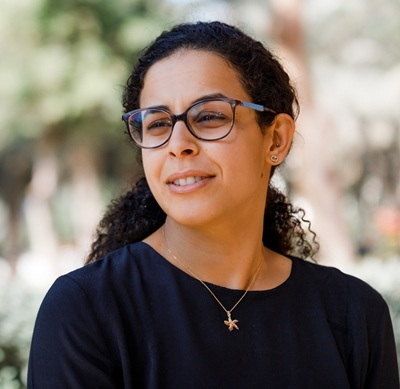

---
lab:
  title: Detectar e analisar rostos
  description: Use o serviço de Detecção facial da Visão de IA do Azure para implementar soluções de detecção e análise facial.
---

# Detectar e analisar rostos

A capacidade de detectar e analisar rostos humanos é uma capacidade central de IA. Neste exercício, você irá explorar o serviço de **Detecção Facial** para trabalhar com rostos.

> **Observação**: Este exercício é baseado em software de SDK pré-lançamento, que pode estar sujeito a alterações. Quando necessário, usamos versões específicas de pacotes que podem não refletir as versões mais recentes disponíveis. Você pode experimentar algum comportamento inesperado, avisos ou erros.

Embora este exercício seja baseado no SDK de Detecção Facial da Visão do Azure para Python, você pode desenvolver aplicativos de visão usando vários SDKs específicos de linguagem, incluindo:

* [Detecção Facial da Visão de IA do Azure para JavaScript](https://www.npmjs.com/package/@azure-rest/ai-vision-face)
* [Detecção Facial da Visão de IA do Azure para Microsoft .NET](https://www.nuget.org/packages/Azure.AI.Vision.Face)
* [Detecção Facial da Visão de IA do Azure para Java](https://central.sonatype.com/artifact/com.azure/azure-ai-vision-face)

Este exercício levará aproximadamente **30** minutos.

> **Observação**: Os recursos dos Serviços de IA do Azure que retornam informações de identificação pessoal são restritos aos clientes que receberam [acesso ilimitado](https://learn.microsoft.com/legal/cognitive-services/computer-vision/limited-access-identity). Este exercício não inclui tarefas de reconhecimento facial e pode ser concluído sem solicitar acesso adicional a recursos restritos.

## Provisionar um recurso de API de Detecção Facial de IA do Azure

Caso ainda não tenha um na sua assinatura, provisione um recurso de API de Detecção Facial de IA do Azure.

> **Observação**: Neste exercício, você usará um recurso autônomo de **Detecção Facial**. Você também pode usar os serviços de Detecção Facial de IA do Azure em um recurso multisserviço dos *Serviços de IA do Azure*, diretamente ou em um projeto da *Fábrica de IA do Azure*.

1. Abra o [portal do Azure](https://portal.azure.com) em `https://portal.azure.com` e entre usando suas credenciais do Azure. Feche todas as mensagens de boas-vindas ou dicas exibidas.
1. Selecione **Criar um recurso**.
1. Na barra de pesquisa, pesquise `Face`, selecione **Detecção Facial** e crie o recurso com as seguintes configurações:
    - **Assinatura**: *sua assinatura do Azure*
    - **Grupo de recursos**: *criar ou selecionar um grupo de recursos*
    - **Região**: *escolha uma região disponível*
    - **Nome**: *Um nome válido para seu recurso de Detecção Facial*
    - **Tipo de preço**: F0 gratuito

1. Crie o recurso, aguarde a conclusão da implantação e exiba os detalhes da implantação.
1. Quando o recurso tiver sido implantado, vá até ele e, no nó de **Gerenciamento de recursos** no painel de navegação, exiba sua página **Chaves e Ponto de Extremidade**. Você precisará do ponto de extremidade e de uma das chaves desta página no próximo procedimento.

## Desenvolver um aplicativo de análise facial com o SDK de Detecção Facial

Neste exercício, você irá completar um aplicativo cliente parcialmente implementado que usa o SDK de Detecção Facial do Azure para detectar e analisar rostos humanos em imagens.

### Preparar a configuração de aplicativo

1. No portal do Azure, use o botão **[\>_]** à direita da barra de pesquisa na parte superior da página para criar um Cloud Shell no portal do Azure selecionando um ambiente do ***PowerShell*** sem armazenamento em sua assinatura.

    O Cloud Shell fornece uma interface de linha de comando em um painel na parte inferior do portal do Azure.

    > **Observação**: se você já criou um Cloud Shell que usa um ambiente *Bash*, alterne-o para o ***PowerShell***.

    > **Observação**: Se o portal solicitar que você selecione um armazenamento para persistir seus arquivos, escolha **Nenhuma conta de armazenamento necessária**, selecione a assinatura que você está usando e pressione **Aplicar**.

1. Na barra de ferramentas do Cloud Shell, no menu **Configurações**, selecione **Ir para a versão clássica** (isso é necessário para usar o editor de código).

    **<font color="red">Verifique se você mudou para a versão clássica do Cloud Shell antes de continuar.</font>**

1. Redimensione o painel do Cloud Shell para que você ainda possa ver a página **Chaves e Ponto de Extremidade** do seu recurso de Detecção Facial.

    > **Dica**" Você pode redimensionar o painel arrastando a borda superior. Você também pode usar os botões minimizar e maximizar para alternar entre o Cloud Shell e a interface do portal principal.

1. No painel do Cloud Shell, insira os seguintes comandos para clonar o repositório GitHub que contém os arquivos de código para este exercício (digite o comando ou copie-o para a área de transferência e clique com o botão direito do mouse na linha de comando e cole como texto sem formatação):

    ```
    rm -r mslearn-ai-vision -f
    git clone https://github.com/MicrosoftLearning/mslearn-ai-vision
    ```

    > **Dica**: ao colar comandos no Cloud Shell, a saída poderá ocupar uma grande quantidade do espaço da tela. Você pode limpar a tela digitando o comando `cls` para facilitar o foco em cada tarefa.

1. Depois que o repositório tiver sido clonado, use o seguinte comando para navegar até os arquivos de código do aplicativo:

    ```
   cd mslearn-ai-vision/Labfiles/face/python/face-api
   ls -a -l
    ```

    A pasta contém a configuração do aplicativo e os arquivos de código para seu aplicativo. Ele também contém uma subpasta **/images**, que contém alguns arquivos de imagem para seu aplicativo analisar.

1. Instale o pacote de SDK do Visão de IA do Azure e outros pacotes necessários executando os seguintes comandos:

    ```
   python -m venv labenv
   ./labenv/bin/Activate.ps1
   pip install -r requirements.txt azure-ai-vision-face==1.0.0b2
    ```

1. Insira o seguinte comando para editar o arquivo de configuração do aplicativo:

    ```
   code .env
    ```

    O arquivo é aberto em um editor de código.

1. No arquivo de código, atualize os valores de configuração para refletir o **ponto de extremidade** e a **chave** de autenticação do seu recurso de Detecção Facial (copiados da página **Chaves e Ponto de Extremidade** no portal do Azure).
1. Depois de substituir os espaços reservados, use o comando **CTRL+S** para salvar suas alterações e, em seguida, use o comando **CTRL+Q** para fechar o editor de código, mantendo a linha de comando do Cloud Shell aberta.

### Adicionar código para criar um cliente de API de Detecção Facial

1. Na linha de comando do Cloud Shell, insira o seguinte comando para abrir o arquivo de código do aplicativo cliente:

    ```
   code analyze-faces.py
    ```

    > **Dica**: Talvez você queira maximizar o painel do Cloud Shell e mover a barra dividida entre o console de linha de comando e o editor de código para que você possa ver o código com mais facilidade.

1. No arquivo de código, localize o comentário **Import namespaces** e adicione o seguinte código para importar os namespaces necessários para usar o SDK do Visão de IA do Azure:

    ```python
   # Import namespaces
   from azure.ai.vision.face import FaceClient
   from azure.ai.vision.face.models import FaceDetectionModel, FaceRecognitionModel, FaceAttributeTypeDetection01
   from azure.core.credentials import AzureKeyCredential
    ```

1. Na função **Main**, observe que o código para carregar as configurações e determinar a imagem a ser analisada foi fornecido. Em seguida, localize o comentário **Authenticate Face client** e adicione o seguinte código para criar e autenticar um objeto **FaceClient**:

    ```python
   # Authenticate Face client
   face_client = FaceClient(
        endpoint=cog_endpoint,
        credential=AzureKeyCredential(cog_key))
    ```

### Adicionar código para detectar e analisar rostos

1. No arquivo de código do seu aplicativo, na função **Main**, localize o comentário **Specify facial features to be retrieved** e adicione o seguinte código:

    ```python
   # Specify facial features to be retrieved
   features = [FaceAttributeTypeDetection01.HEAD_POSE,
                FaceAttributeTypeDetection01.OCCLUSION,
                FaceAttributeTypeDetection01.ACCESSORIES]
    ```

1. Na função **Main**, abaixo do código que você acabou de adicionar, localize o comentário **Get faces** e adicione o seguinte código para imprimir as informações das características faciais e chamar uma função que anota a imagem com a caixa delimitadora de cada rosto detectado (com base na propriedade **face_rectangle **de cada rosto):

    ```Python
   # Get faces
   with open(image_file, mode="rb") as image_data:
        detected_faces = face_client.detect(
            image_content=image_data.read(),
            detection_model=FaceDetectionModel.DETECTION01,
            recognition_model=FaceRecognitionModel.RECOGNITION01,
            return_face_id=False,
            return_face_attributes=features,
        )

   face_count = 0
   if len(detected_faces) > 0:
        print(len(detected_faces), 'faces detected.')
        for face in detected_faces:
    
            # Get face properties
            face_count += 1
            print('\nFace number {}'.format(face_count))
            print(' - Head Pose (Yaw): {}'.format(face.face_attributes.head_pose.yaw))
            print(' - Head Pose (Pitch): {}'.format(face.face_attributes.head_pose.pitch))
            print(' - Head Pose (Roll): {}'.format(face.face_attributes.head_pose.roll))
            print(' - Forehead occluded?: {}'.format(face.face_attributes.occlusion["foreheadOccluded"]))
            print(' - Eye occluded?: {}'.format(face.face_attributes.occlusion["eyeOccluded"]))
            print(' - Mouth occluded?: {}'.format(face.face_attributes.occlusion["mouthOccluded"]))
            print(' - Accessories:')
            for accessory in face.face_attributes.accessories:
                print('   - {}'.format(accessory.type))
            # Annotate faces in the image
            annotate_faces(image_file, detected_faces)
    ```

1. Examine o código que você adicionou à função **Main**. Ele analisa um arquivo de imagem e detecta quaisquer rostos que ela contenha, incluindo atributos de posição da cabeça, oclusão e a presença de acessórios, como óculos. Além disso, uma função é chamada para anotar a imagem original com uma caixa delimitadora para cada rosto detectado.
1. Salve suas alterações (*CTRL+S*), mas mantenha o editor de código aberto caso precise corrigir qualquer erro de digitação.

1. Redimensione os painéis para conseguir ver mais do console e, em seguida, digite o seguinte comando para executar o programa com o argumento *images/face1.jpg*:

    ```
   python analyze-faces.py images/face1.jpg
    ```

    O aplicativo é executado e analisa a seguinte imagem:

    

1. Observe a saída, que deve incluir a ID e os atributos de cada rosto detectado. 
1. Note que um arquivo de imagem chamado **detected_faces.jpg** também foi gerado. Use o comando (específico do Azure Cloud Shell) **download** para baixá-lo:

    ```
   download detected_faces.jpg
    ```

    O comando download cria um link pop-up no canto inferior direito do seu navegador, que você pode selecionar para baixar e abrir o arquivo. A imagem deve ser semelhante a esta:

    

1. Execute o programa novamente, desta vez especificando o parâmetro *images/face2.jpg* para extrair texto da seguinte imagem:

    

    ```
   python analyze-faces.py images/face2.jpg
    ```

1. Baixe e exiba o arquivo de **detected_faces.jpg** resultante :

    ```
   download detected_faces.jpg
    ```

    A imagem resultante ficará assim:

    

1. Execute o programa mais uma vez, desta vez especificando o parâmetro *images/faces.jpg* para extrair texto desta imagem:

    

    ```
   python analyze-faces.py images/faces.jpg
    ```

1. Baixe e exiba o arquivo de **detected_faces.jpg** resultante :

    ```
   download detected_faces.jpg
    ```

    A imagem resultante ficará assim:

    

## Limpar os recursos

Se tiver terminado de explorar o Visão de IA do Azure, deverá excluir os recursos que criou neste exercício para evitar incorrer em custos desnecessários do Azure:

1. Abra o portal do Azure em `https://portal.azure.com`,e na barra de pesquisa superior, procure os recursos criados neste laboratório.

1. Na página de recursos, selecione **Excluir** e siga as instruções para excluir o recurso. Como alternativa, você pode excluir todo o grupo de recursos para limpar todos os recursos ao mesmo tempo.
