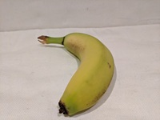

---
lab:
  title: Classificar imagens
  description: Use a Visão Personalizada de IA do Azure para treinar um modelo de classificação de imagens.
---

# Classificar imagens

O serviço de **Visão Personalizada de IA do Azure** permite que você crie modelos de Pesquisa Visual Computacional treinados com suas próprias imagens. Você pode usar para treinar os modelos de *classificação de imagem* e *detecção de objetos*, que podem ser publicados e consumidos em aplicativos.

Neste exercício, você usa o serviço Visão Personalizada para treinar um modelo de classificação de imagem capaz de identificar três classes de frutas (maçã, banana e laranja).

Embora este exercício seja baseado no SDK de Visão Personalizada do Azure para Python, você pode desenvolver aplicativos de visão usando vários SDKs específicos de linguagem; incluindo:

* [Visão Personalizada do Azure para JavaScript (treinamento)](https://www.npmjs.com/package/@azure/cognitiveservices-customvision-training)
* [Visão Personalizada do Azure para JavaScript (previsão)](https://www.npmjs.com/package/@azure/cognitiveservices-customvision-prediction)
* [Visão Personalizada do Azure para Microsoft .NET (treinamento)](https://www.nuget.org/packages/Microsoft.Azure.CognitiveServices.Vision.CustomVision.Training/)
* [Visão Personalizada do Azure para Microsoft .NET (previsão)](https://www.nuget.org/packages/Microsoft.Azure.CognitiveServices.Vision.CustomVision.Prediction/)
* [Visão Personalizada do Azure para Java (treinamento)](https://search.maven.org/artifact/com.azure/azure-cognitiveservices-customvision-training/1.1.0-preview.2/jar)
* [Visão Personalizada do Azure para Java (previsão)](https://search.maven.org/artifact/com.azure/azure-cognitiveservices-customvision-prediction/1.1.0-preview.2/jar)

Este exercício levará, aproximadamente, **45** minutos.

## Criar recursos de Visão Personalizada

Antes de treinar um modelo, você precisará de recursos do Azure para *treinamento* e *previsão*. Você pode criar recursos de **Visão Personalizada** para cada uma dessas tarefas ou criar um único recurso e usá-lo para ambas. Neste exercício, você criará recursos de **Visão Personalizada** para treinamento e previsão.

1. Abra o [portal do Azure](https://portal.azure.com) em `https://portal.azure.com` e entre usando suas credenciais do Azure. Feche todas as mensagens de boas-vindas ou dicas exibidas.
1. Selecione **Criar um recurso**.
1. Na barra de pesquisa, pesquise `Custom Vision`, selecione **Visão Personalizada** e crie o recurso com as seguintes configurações:
    - **Criar opções**: ambos
    - **Assinatura**: *sua assinatura do Azure*
    - **Grupo de recursos**: *criar ou selecionar um grupo de recursos*
    - **Região**: *escolha uma região disponível*
    - **Nome**: *Um nome válido para seu recurso de Visão Personalizada*
    - **Tipo de preço de treinamento**: F0
    - **Tipo de preço da previsão**: F0

1. Crie o recurso, aguarde a conclusão da implantação e exiba os detalhes da implantação. Observe que dois recursos de Visão Personalizada são provisionados: um para treinamento e outro para previsão.

    > **Observação**: Cada recurso tem seu próprio *ponto de extremidade* e *chaves*, que são usadas para gerenciar o acesso do seu código. Para treinar um modelo de classificação de imagem, seu código deve usar o recurso de *treinamento* (com seu ponto de extremidade e chave) e, para usar o modelo treinado para prever classes de imagem, seu código deve usar o recurso de *previsão* (com seu ponto de extremidade e chave).

1. Quando os recursos tiverem sido implantados, vá para o grupo de recursos para exibi-los. Você deverá ver dois recursos de Visão Personalizada, sendo um com o sufixo ***-Previsão***.

## Criar um projeto de Visão Personalizada no portal de Visão Personalizada

Para treinar um modelo de classificação de imagens, você precisa criar um projeto de Visão Personalizada com base em seu recurso de treinamento. Para fazer isso, você usará o portal de Visão Personalizada.

1. Abra uma nova guia do navegador (mantendo a guia do portal do Azure aberta – você retornará a ela mais tarde).
1. Em uma nova guia do navegador, abra o [portal de Visão Personalizada](https://customvision.ai) em `https://customvision.ai`. Se solicitado, entre usando suas credenciais do Azure e concorde com os termos de serviço.
1. No portal de Visão Personalizada, crie um projeto com as seguintes configurações:
    - **Nome**: `Classify Fruit`
    - **Descrição**: `Image classification for fruit`
    - **Recurso**: *Seu recurso de Visão Personalizada*
    - **Tipos de Projeto**: Classificação
    - **Tipos de classificação**: Multiclasse (tag única por imagem)
    - **Domínios**: comida

### Carregar e marcar imagens

1. Em uma nova guia do navegador, baixe as [imagens de treinamento](https://github.com/MicrosoftLearning/mslearn-ai-vision/raw/main/Labfiles/image-classification/training-images.zip) de `https://github.com/MicrosoftLearning/mslearn-ai-vision/raw/main/Labfiles/image-classification/training-images.zip` e extraia a pasta zip para exibir seu conteúdo. Esta pasta contém subpastas de imagens de maçã, banana e laranja.
1. No portal da Visão Personalizada, no seu projeto de classificação de imagens, clique em **Adicionar imagens** e selecione todos os arquivos na pasta **training-images/apple** que você baixou e extraiu anteriormente. Em seguida, carregue os arquivos de imagem, especificando a marca `apple`, desta forma:

    

1. Use o ícone da barra de ferramentas **Adicionar Imagens** (**[+]**) para repetir a etapa anterior e fazer o upload das imagens na pasta **banana** com a marca `banana` e das imagens na pasta **orange** com a marca `orange`.
1. Explore as imagens que você carregou no projeto de Visão Personalizada – deve haver 15 imagens de cada classe, desta forma:

    

### Treinar um modelo

1. No projeto de Visão Personalizada, acima das imagens, clique em **Treinar** (&#9881;<sub>&#9881;</sub>) para treinar um modelo de classificação usando as imagens com marcas. Selecione a opção de **Treinamento Rápido** e aguarde a conclusão da iteração de treinamento (isso pode levar mais ou menos um minuto).
1. Quando a iteração do modelo tiver sido treinada, revise as métricas de desempenho de *Precisão*, *Recall* e *PA* – elas medem a precisão de predição do modelo de classificação e devem ser todas altas.

    

> **Observação**: as métricas de desempenho são baseadas em um limite de probabilidade de 50% para cada previsão (em outras palavras, se o modelo calcular uma probabilidade de 50% ou mais de que uma imagem seja de uma classe específica, essa classe será prevista). Você pode ajustar isso no canto superior esquerdo da página.

### Testar o modelo

1. Acima das métricas de desempenho, clique em **Início Rápido**.
1. Na caixa **URL da Imagem**, digite `https://aka.ms/test-apple` e clique no botão *imagem de teste rápido (&#10132;)* .
1. Exiba as previsões retornadas por seu modelo – a pontuação de probabilidade para *maçã* deve ser a mais alta, assim:

    

1. Tente testar as seguintes imagens:
    - `https://aka.ms/test-banana`
    - `https://aka.ms/test-orange`

1. Feche a janela **Teste Rápido**.

### Exibir as configurações do projeto

O projeto que você criou recebeu um identificador exclusivo, que você precisará especificar em qualquer código que interaja com ele.

1. Clique no ícone *configurações* (&#9881;) no canto superior direito da página **Desempenho** para exibir as configurações do projeto.
1. Em **Geral** (à esquerda), anote a **ID do projeto** que identifica exclusivamente este projeto.
1. À direita, em **Recursos**, observe que a chave e o ponto de extremidade são mostrados. Esses são os detalhes do recurso de *treinamento* (você também pode obter essas informações exibindo o recurso no portal do Azure).

## Usar a API de *treinamento*

O portal de Visão Personalizada fornece uma interface de usuário conveniente que você pode usar para carregar e marcar imagens e treinar modelos. No entanto, em alguns cenários, convém automatizar o treinamento de modelo usando a API de treinamento de Visão Personalizada.

### Preparar a configuração de aplicativo

1. Retorne à guia do navegador que contém o portal do Azure (mantendo a guia do portal de Visão Personalizada aberta – você retornará a ela mais tarde).
1. No portal do Azure, use o botão **[\>_]** à direita da barra de pesquisa na parte superior da página para criar um Cloud Shell no portal do Azure selecionando um ambiente do ***PowerShell*** sem armazenamento em sua assinatura.

    O Cloud Shell fornece uma interface de linha de comando em um painel na parte inferior do portal do Azure.

    > **Observação**: se você já criou um Cloud Shell que usa um ambiente *Bash*, alterne-o para o ***PowerShell***.

    > **Observação**: Se o portal solicitar que você selecione um armazenamento para persistir seus arquivos, escolha **Nenhuma conta de armazenamento necessária**, selecione a assinatura que você está usando e pressione **Aplicar**.

1. Na barra de ferramentas do Cloud Shell, no menu **Configurações**, selecione **Ir para a versão clássica** (isso é necessário para usar o editor de código).

    **<font color="red">Verifique se você mudou para a versão clássica do Cloud Shell antes de continuar.</font>**

1. Redimensione o painel do Cloud Shell para conseguir ver mais dele.

    > **Dica**" Você pode redimensionar o painel arrastando a borda superior. Você também pode usar os botões minimizar e maximizar para alternar entre o Cloud Shell e a interface do portal principal.

1. No painel do Cloud Shell, insira os seguintes comandos para clonar o repositório GitHub que contém os arquivos de código para este exercício (digite o comando ou copie-o para a área de transferência e clique com o botão direito do mouse na linha de comando e cole como texto sem formatação):

    ```
    rm -r mslearn-ai-vision -f
    git clone https://github.com/MicrosoftLearning/mslearn-ai-vision
    ```

    > **Dica**: conforme você colar comandos no cloudshell, a saída pode ocupar uma grande quantidade do espaço da tela. Você pode limpar a tela digitando o comando `cls` para facilitar o foco em cada tarefa.

1. Depois que o repositório tiver sido clonado, use o seguinte comando para navegar até os arquivos de código do aplicativo:

    ```
   cd mslearn-ai-vision/Labfiles/image-classification/python/train-classifier
   ls -a -l
    ```

    A pasta contém a configuração do aplicativo e os arquivos de código para seu aplicativo. Ela também contém uma subpasta **/more-training-images**, que inclui alguns arquivos de imagem que você usará para realizar treinamento adicional do seu modelo.

1. Instale o pacote do SDK da Visão Personalizada da IA do Azure para treinamento e quaisquer outros pacotes necessários executando os seguintes comandos:

    ```
   python -m venv labenv
   ./labenv/bin/Activate.ps1
   pip install -r requirements.txt azure-cognitiveservices-vision-customvision
    ```

1. Insira o seguinte comando para editar o arquivo de configuração do aplicativo:

    ```
   code .env
    ```

    O arquivo é aberto em um editor de código.

1. No arquivo de código, atualize os valores de configuração para refletir o **Ponto de extremidade** e a **Chave** de autenticação do seu recurso de *treinamento* da Visão Personalizada, e a **ID do Projeto** do projeto de Visão Personalizada que você criou anteriormente.
1. Depois de substituir os espaços reservados, no editor de código, use o comando **CTRL+S** para salvar as alterações e então use **CTRL+Q** para fechar o editor de código, mantendo a linha de comando do Cloud Shell aberta.

### Escrever código para executar o treinamento de modelo

1. Na linha de comando do Cloud Shell, insira o seguinte comando para abrir o arquivo de código do aplicativo cliente:

    ```
   code train-classifier.py
    ```

1. Observe os seguintes detalhes no arquivo de código:
    - Os namespaces do SDK de Visão Personalizada da IA do Azure são importados.
    - A função **Main** recupera as configurações e usa a chave e o ponto de extremidade para criar um cliente autenticado.
    - **CustomVisionTrainingClient**, que é então usado com a ID do projeto para criar uma referência **Project** ao seu projeto.
    - A função **Upload_Images** recupera as marcas definidas no projeto de visão personalizada e, em seguida, carrega arquivos de imagem de pastas nomeadas correspondentes para o projeto, atribuindo a ID de marca apropriada.
    - A função **Train_Model** cria uma nova iteração de treinamento para o projeto e aguarda a conclusão do treinamento.

1. Feche o editor de código (*CTRL+Q*) e insira o seguinte comando para executar o programa:

    ```
   python train-classifier.py
    ```

1. Aguarde até que o programa finalize. Em seguida, volte para a aba do navegador que contém o portal de Visão Personalizada e visualize a página **Treinamento de Imagens** do seu projeto (atualizando o navegador, se necessário).
1. Verifique se algumas novas imagens marcadas foram adicionadas ao projeto. Em seguida, exiba a página **Desempenho** e verifique se uma nova iteração foi criada.

## Usar o classificador de imagens em um aplicativo cliente

Agora está tudo pronto para publicar seu modelo treinado e usá-lo em um aplicativo cliente.

### Publicar o modelo de classificação de imagem

1. No portal Visão Personalizada, na página **Desempenho**, clique em **&#128504; Publicar** para publicar o modelo treinado com as seguintes configurações:
    - **Nome do modelo**: `fruit-classifier`
    - **Recurso de previsão**: *o recurso de **previsão** que você criou anteriormente que termina com "-Prediction" (<u>não</u> o recurso de treinamento)*.
1. No canto superior esquerdo da página **Configurações do Projeto**, clique no ícone *Galeria de Projetos* (&#128065;) para retornar à página inicial do portal Visão Personalizada, onde seu projeto agora está listado.
1. Na página inicial do portal Visão Personalizada, no canto superior direito, clique no ícone *configurações* (&#9881;) para exibir as configurações do serviço Visão Personalizada. Em seguida, em **Recursos**, localize seu recurso de *previsão* que termina com "-Prediction" (<u>não</u> o recurso de treinamento) para determinar seus valores de **Chave** e **ponto de extremidade** (você também pode obter essas informações exibindo o recurso no portal do Azure).

### Usar o classificador de imagens de um aplicativo cliente

1. Retorne à guia do navegador que contém o portal do Azure e o painel do Cloud Shell.
1. No Cloud Shell, execute os seguintes comandos para alternar para a pasta do aplicativo cliente e exibir os arquivos que ele contém:

    ```
   cd ../test-classifier
   ls -a -l
    ```

    A pasta contém a configuração do aplicativo e os arquivos de código para seu aplicativo. Ela também contém uma subpasta **/test-images**, que inclui alguns arquivos de imagem que você usará para testar seu modelo.

1. Instale o pacote do SDK da Visão Personalizada da IA do Azure para previsão e quaisquer outros pacotes necessários executando os seguintes comandos:

    ```
   python -m venv labenv
   ./labenv/bin/Activate.ps1
   pip install -r requirements.txt azure-cognitiveservices-vision-customvision
    ```

1. Insira o seguinte comando para editar o arquivo de configuração do aplicativo:

    ```
   code .env
    ```

    O arquivo é aberto em um editor de código.

1. Atualize os valores de configuração para refletir o **Ponto de extremidade** e a **Chave** do seu recurso de Visão Personalizada para *<u>previsão</u>*, a **ID do Projeto** para classificação do projeto e o nome do seu modelo publicado (que deve ser *fruit-classifier*). Salve suas alterações (*CTRL+S*) e feche o editor de código (*CTRL+Q*).
1. Na linha de comando do Cloud Shell, insira o seguinte comando para abrir o arquivo de código do aplicativo cliente:

    ```
   code test-classifier.py
    ```

1. Examine o código, observando os seguintes detalhes:
    - Os namespaces do SDK de Visão Personalizada da IA do Azure são importados.
    - A função **Principal** recupera as definições de configuração e usa a chave e o ponto de extremidade para criar um **CustomVisionPredictionClient** autenticado.
    - O objeto de cliente de previsão é usado para prever uma classe para cada imagem na pasta **test-images**, especificando a ID do projeto e o nome do modelo para cada solicitação. Cada previsão inclui uma probabilidade para cada classe possível, e apenas as tags previstas com uma probabilidade maior que 50% são exibidas.

1. Feche o editor de código e insira o seguinte comando para executar o programa:

    ```
   python test-classifier.py
    ```

    O programa envia cada uma das seguintes imagens para o modelo de classificação:

    

    **IMG_TEST_1.jpg**

    <br/><br/>

    

    **IMG_TEST_2.jpg**

    <br/><br/>

    

    **IMG_TEST_3.jpg**

1. Exiba o rótulo (marcação) e as pontuações de probabilidade para cada previsão.

## Limpar os recursos

Se tiver terminado de explorar o Visão Personalizada de IA do Azure, deverá excluir os recursos que criou neste exercício para evitar incorrer em custos desnecessários do Azure:

1. Abra o portal do Azure em `https://portal.azure.com`,e na barra de pesquisa superior, procure os recursos criados neste laboratório.

1. Na página de recursos, selecione **Excluir** e siga as instruções para excluir o recurso. Como alternativa, você pode excluir todo o grupo de recursos para limpar todos os recursos ao mesmo tempo.
